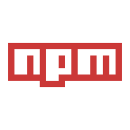
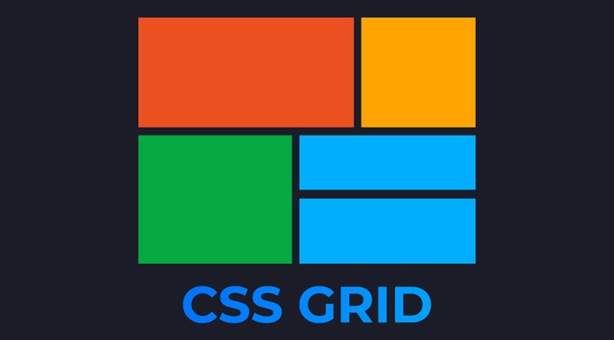

## 🎥  Preview site :arrow_right: [clickHere](https://szymonrojek.github.io/to-do-list-react/)


## Description:
This is a simple To-Do list application, helps to organize our daily tasks. Use it to capture and organize tasks the moment they pop into your head. 

## Technologies:

<table>
  <tr>
    <td></td>
    <td></td>
  </tr>
</table>
<table>
  <tr>
    <td></td>
    <td></td>
  </tr>
</table>
<table>
  <tr>
    <td></td>
       <td></td>
  </tr>
 </table>
<table>
  <tr>
    <td> </td>
  </tr>
 </table>

This project was bootstrapped with **Create React App**.

## I have used:
:white_check_mark: react-dom, react-redux, redux toolkit
<br>
:white_check_mark: Styled Components
<br>
:white_check_mark: Functional Components
<br>
:white_check_mark: ES6 + features
<br>
:white_check_mark: Hooks: useState, useEffect, useRef, useSelector, useDispatch
<br>
:white_check_mark: Custom Hooks
<br>
:white_check_mark: Local Storage
<br>
:white_check_mark: Responsive Web Design

## Available Scripts:

**1.** Install packages in the directory:
```
npm install
```

**2.** To start development and server
```
npm start
```
Runs the app in the development mode.
Open http://localhost:3000 to view it in the browser.

The page will reload if you make edits.
You will also see any lint errors in the console.

**3.** Build version
```
npm run build
```
Builds the app for production to thpm se build folder.
It correctly bundles React in production mode and optimizes the build for the best performance.

The build is minified and the filenames include the hashes.
Your app is ready to be deployed!

**4.** Gh-pages deploy
```
npm run deploy
```

**5.** Eject
```
npm run eject
```
**Note:** this is a one-way operation. Once you eject, you can’t go back! This command will remove the single build dependency from your project.