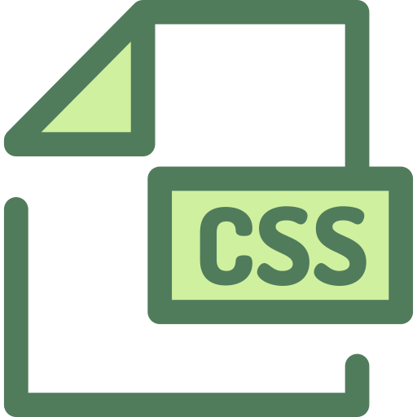

## 🎥  Preview site :arrow_right: [clickHere](https://szymonrojek.github.io/to-do-list-react/)

## Description:
This is a simple To-Do list application - this project was bootstrapped with **Create React App**., helps to organize our daily tasks. Use it to capture and organize tasks the moment they pop into your head. 

## Technologies:

<table>
  <tr>
    <td></td>
    <td></td>
    <td></td>
   
  </tr>
</table>
<table>
  <tr>
    <td></td>
       <td></td>
  </tr>
 </table>
<table>
  <tr>
    <td> </td>
  </tr>
 </table>


## I have used:
:white_check_mark: Responsive Web Design
<br>
:white_check_mark: Create React App
<br>
:white_check_mark: Functional Components
<br>
:white_check_mark: ES6+
<br>
:white_check_mark: Immutability Concept
<br>
:white_check_mark: Local Storage

## Available Scripts:

1. To start development and server
```
npm start
```
Runs the app in the development mode.
Open http://localhost:3000 to view it in the browser.

The page will reload if you make edits.
You will also see any lint errors in the console.

2. Build version
```
npm run build
```
Builds the app for production to thpm se build folder.
It correctly bundles React in production mode and optimizes the build for the best performance.

The build is minified and the filenames include the hashes.
Your app is ready to be deployed!

3. Gh-pages deploy
```
npm run deploy
```
Note: this is a one-way operation. Once you eject, you can’t go back!

If you aren’t satisfied with the build tool and configuration choices, you can eject at any time. This command will remove the single build dependency from your project.

Instead, it will copy all the configuration files and the transitive dependencies (webpack, Babel, ESLint, etc) right into your project so you have full control over them. All of the commands except eject will still work, but they will point to the copied scripts so you can tweak them. At this point you’re on your own.

You don’t have to ever use eject. The curated feature set is suitable for small and middle deployments, and you shouldn’t feel obligated to use this feature. However we understand that this tool wouldn’t be useful if you couldn’t customize it when you are ready for it.

4. Eject
```
npm run eject
```
